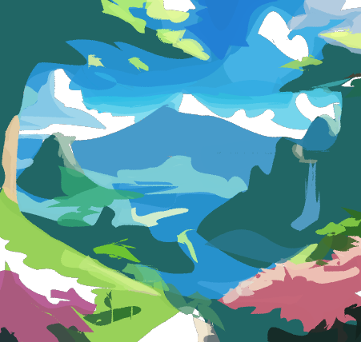

# LIVBOC- Layer-wise Image Vectorization via Bayesian-Optimized Contours (VISAPP 2025)
<style>
.main {
  /* height: 180px; */
  /* border: 1px solid #c3c3c3; */
  display: flex;
  width: max-content;
  text-align:center;
}

.main div {
  /* flex: 0 0 50px; */
  margin: 2px;
}
</style>
[Ghfran Jabour](ghoghoghfran.jabour@gmail.com), 
[Sergey Muravyov](mursmail@gmail.com), 
[Valeria Efimova](valeryefimova@gmail.com), 

<br><br>

<div class="main">
  <div>  
    <div>
      
    </div>
    <div>Original</div>
  </div>
  <div>  
    <div>
      
    </div>
    <div>Path Num: 32</div>
  </div>
  <div>  
    <div>
      
    </div>
    <div>Path Num: 64</div>
  </div>
  <div>  
    <div>
      
    </div>
    <div>Path Num: 128</div>
  </div>
</div>

<div class="main">
  <div>  
    <div>
      
    </div>
    <div>Original</div>
  </div>
  <div>  
    <div>
      
    </div>
    <div>Path Num: 64</div>
  </div>
  <div>  
    <div>
      
    </div>
    <div>Path Num: 128</div>
  </div>
  <div>  
    <div>
      
    </div>
    <div>Path Num: 256</div>
  </div>
</div>

<div class="main">
  <div>  
    <div>
      
    </div>
    <div>Original</div>
  </div>
  <div>  
    <div>
      
    </div>
    <div>Path Num: 32</div>
  </div>
  <div>  
    <div>
      
    </div>
    <div>Path Num: 64</div>
  </div>
  <div>  
    <div>
      
    </div>
    <div>Path Num: 128</div>
  </div>
</div>

<br><br>
We introduce a new image vectorization method that generates SVG images from raster images with the help of Bayesian optimization algorithm to optimize key parameters for extracting contours and turning them into vectors, and the K-means algorithm to extract the suitable color for that vector. Then that vector is optimized to properly align with the targeted shape.

<div class="main">
  <div>  
    <div>
      
    </div>
    <div>Original</div>
  </div>
  <div>  
    <div>
      
    </div>
    <div>Vectors Initialized</div>
  </div>
  <div>  
    <div>
      
    </div>
    <div>Vectors Optimization</div>
  </div>
</div>
<div class="main">
  <div>  
    <div>
      
    </div>
    <div>Original</div>
  </div>
  <div>  
    <div>
      
    </div>
    <div>Vectors Initialized</div>
  </div>
  <div>  
    <div>
      
    </div>
    <div>Vectors Optimization</div>
  </div>
</div>
<br><br><br><br>
In the following image, from left to right we display: 
1) Input image in raster format. 
2) Vectors initialized by the Bayesian optimization and the K-means algorithms. 
3) Vectors being optimized to form the final output.

The image representing a girl is composed of 50 vectors, and the other one representing a deer is composed of 32 vectors.

## Installation
We suggest users to use the conda for creating new python environment. 

**Requirement**: 5.0<GCC<6.0;  nvcc >10.0.

```bash
git clone https://github.com/Picsart-AI-Research/LIVE-Layerwise-Image-Vectorization.git
cd LIVE-Layerwise-Image-Vectorization
conda create -n live python=3.10
conda activate live
conda install -y pytorch torchvision -c pytorch
conda install -y numpy scikit-image
conda install -y -c anaconda cmake
conda install -y -c conda-forge ffmpeg
pip install svgwrite svgpathtools cssutils numba torch-tools scikit-fmm easydict visdom
pip install opencv-python  # please install this version to avoid segmentation fault.

```


## Run Experiments 
```bash
conda activate live
cd LIVE
# Please modify the paramters accordingly.
python main.py --config <config.yaml> --experiment <experiment-setting> --signature <given-folder-name> --target <input-image> --log_dir <log-dir>
# Here is an simple example:
python main.py --config config/base.yaml --experiment experiment_50 --signature girl4 --target figures/girl4.png.png --log_dir log/
```

## Acknowledgement
Our implementation is mainly based on the [diffvg](https://github.com/BachiLi/diffvg) codebase. We gratefully thank the authors for their wonderful works.


## LICENSE
LIVBOC is a derivative of the LIVE project and remains under the Apache-2.0 license.


